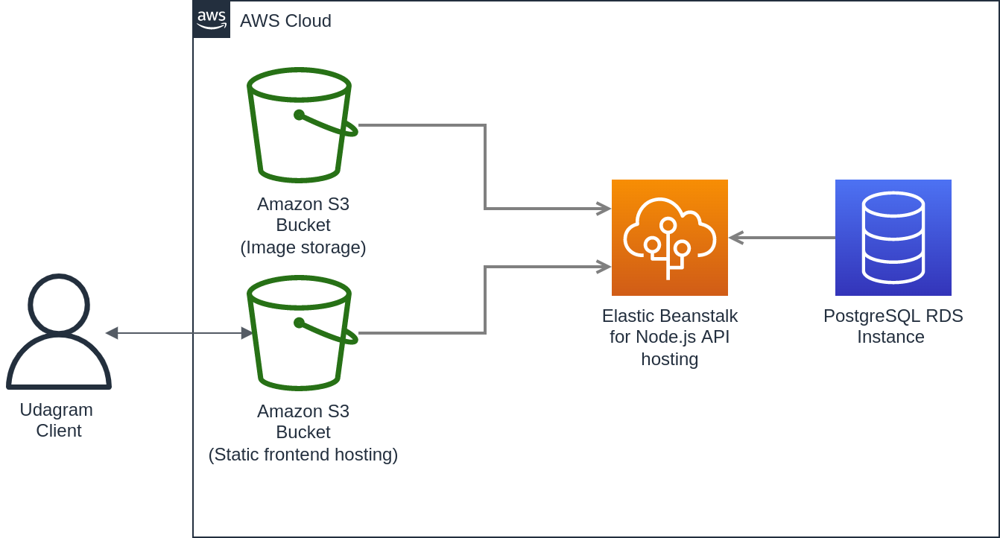
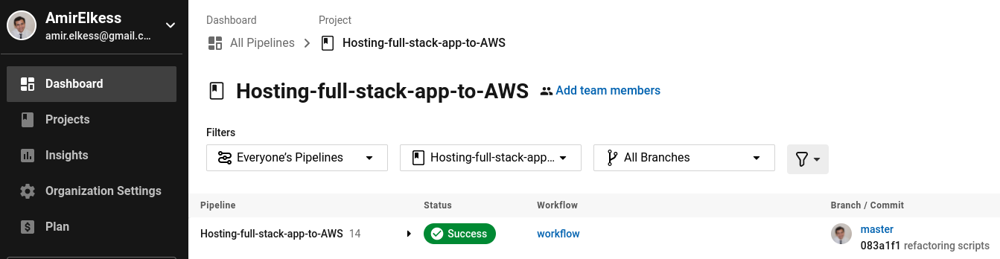
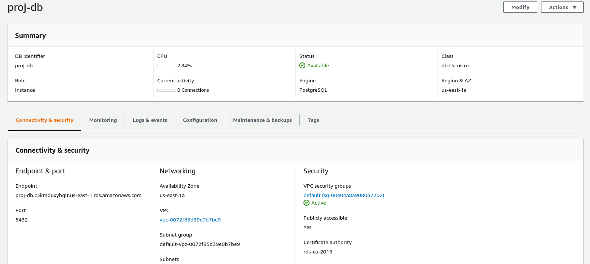

# Udagram

Link to access the app: [Udagram](http://amirbuckettest123.s3-website-us-east-1.amazonaws.com) <br>

---
## Application Infrastructure

### Services in use
* `circleci`: For managing the CI/CD pipeline 
* `RDS`: An instance with class 'db.t3.micro' running PostgreSQL  is created
* `EB`: Node.js API hosting
* `S3`: Two buckets were created:
    1. For hosting static frontend
    2. For hosting images uploaded by users

### Diagram


---
## CircleCI pipeline

When pushing code to the github repo, the following sequence is triggered by CircleCI:


---
## Project dependencies

### Backend (API) dependencies
* bcrypt
* JWT
* aws-sdk
* body-parser
* cors
* dotenv
* email-validator
* express
* pg (PostgreSQL client)
* sequelize

### Frontend dependencies
* Angular
* Ionic

### Common dependencies

* Node 16.15.0
* NPM

### CLI tools
* EB CLI 3.20.3 (Python 3.10.)
* AWS CLI 1.22.88 (Python 3.10.)

---
## Documentation of AWS and CircleCI environments

CircleCI access to the github repo:


CircleCI last successful build:


CircleCI environment variables:


AWS healthy RDS instance:


AWS healthy EB instance:


AWS healthy S3 frontend-hosting instance:

---
## Getting Started

1. Clone this repo locally into the location of your choice.
1. Move the content of the udagram folder at the root of the repository as this will become the main content of the project.
1. Open a terminal and navigate to the root of the repo
1. follow the instructions in the installation step

The project can run but is missing some information to connect to the database and storage service. These will be setup during the course of the project

### Dependencies

```
- Node v14.15.1 (LTS) or more recent. While older versions can work it is advisable to keep node to latest LTS version

- npm 6.14.8 (LTS) or more recent, Yarn can work but was not tested for this project

- AWS CLI v2, v1 can work but was not tested for this project

- A RDS database running Postgres.

- A S3 bucket for hosting uploaded pictures.

```

### Installation

Provision the necessary AWS services needed for running the application:

1. In AWS, provision a publicly available RDS database running Postgres. <Place holder for link to classroom article>
1. In AWS, provision a s3 bucket for hosting the uploaded files. <Place holder for tlink to classroom article>
1. Export the ENV variables needed or use a package like [dotnev](https://www.npmjs.com/package/dotenv)/.
1. From the root of the repo, navigate udagram-api folder `cd starter/udagram-api` to install the node_modules `npm install`. After installation is done start the api in dev mode with `npm run dev`.
1. Without closing the terminal in step 1, navigate to the udagram-frontend `cd starter/udagram-frontend` to intall the node_modules `npm install`. After installation is done start the api in dev mode with `npm run start`.

## Testing

This project contains two different test suite: unit tests and End-To-End tests(e2e). Follow these steps to run the tests.

1. `cd starter/udagram-frontend`
1. `npm run test`
1. `npm run e2e`

There are no Unit test on the back-end

### Unit Tests:

Unit tests are using the Jasmine Framework.

### End to End Tests:

The e2e tests are using Protractor and Jasmine.

## Built With

- [Angular](https://angular.io/) - Single Page Application Framework
- [Node](https://nodejs.org) - Javascript Runtime
- [Express](https://expressjs.com/) - Javascript API Framework

## License

[License](LICENSE.txt)
