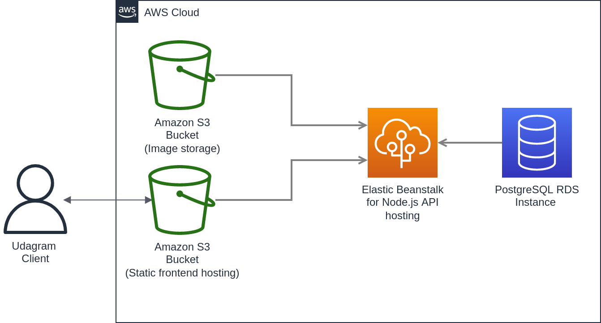

# Application Infrastructure

### Services in use
* `circleci`: For managing the CI/CD pipeline 
* `RDS`: An instance with class 'db.t3.micro' running PostgreSQL  is created
* `EB`: Node.js API hosting
* `S3`: Two buckets were created:
    1. For hosting static frontend
    2. For hosting images uploaded by users

### Diagram
