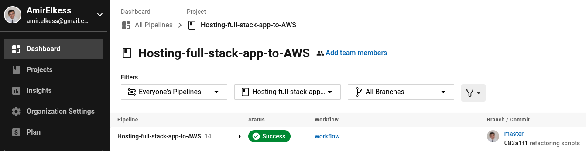
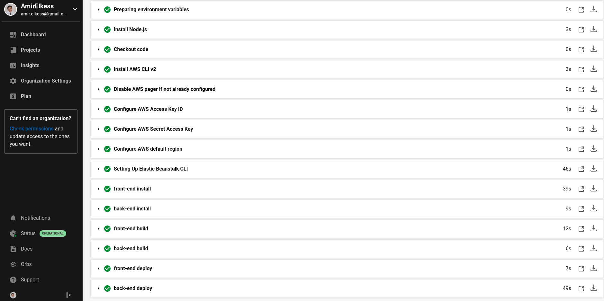
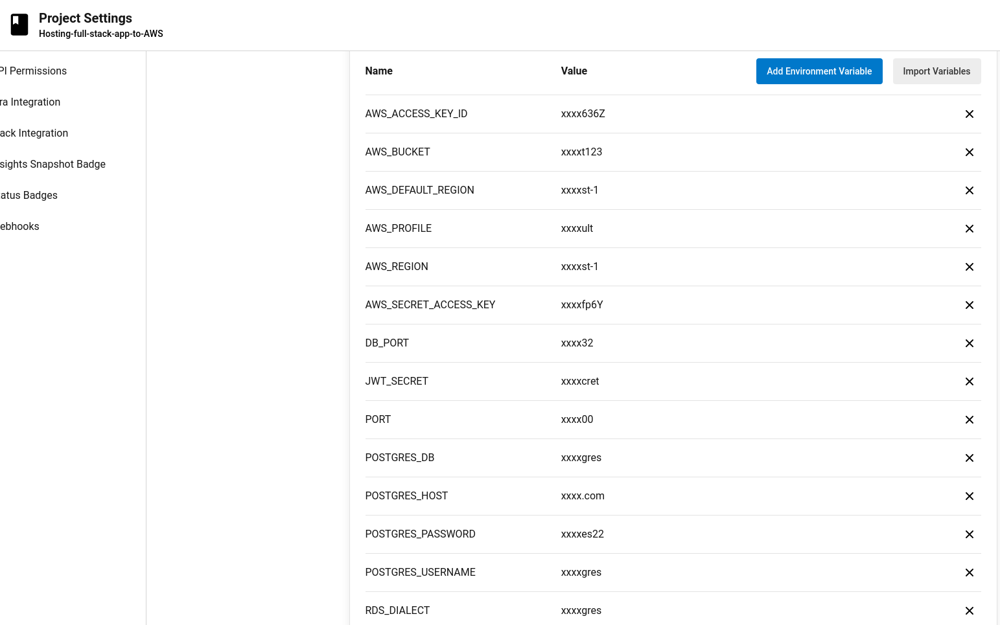
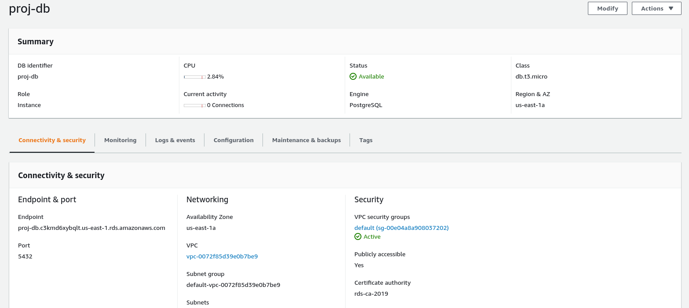
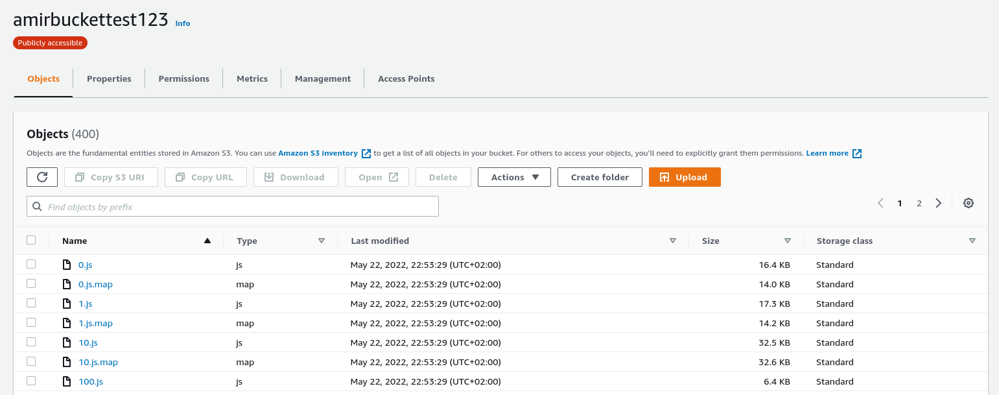

# Documentation of AWS and CircleCI environments

CircleCI access to the github repo:

CircleCI last successful build:

CircleCI environment variables:

AWS healthy RDS instance:

AWS healthy EB instance:

AWS healthy S3 frontend-hosting instance:
